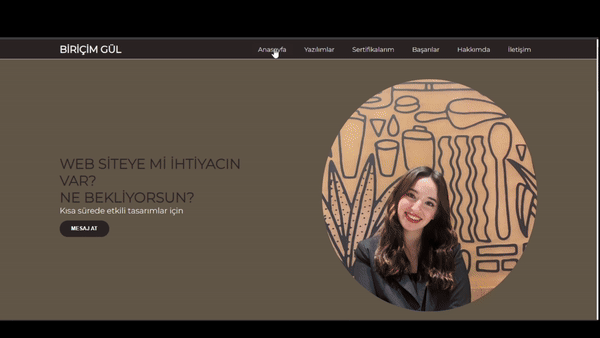

<h1> Portfolio Project </h1>

This project represents a personal website.It enhances the user experience with responsive design and impressive visuals, allowing visitors to effortlessly access relevant.

<h2> The technologies used in the project </h2>

It was coded using HTML, CSS, and JavaScript technologies.

<h2> Screenshot </h2>

